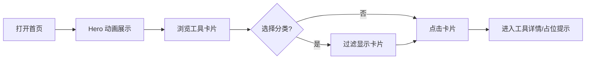

## 1. 产品概述

MAX 工具箱是一个面向年轻用户的趣味工具聚合主页，采用 Apple 系统级设计语言，强调留白、玻璃质感、流畅动画与精致微交互。首期聚焦首页展示，后续可扩展更多工具页面。

- **目标用户**：喜欢二次元文化、追求视觉体验的互联网用户
- **核心价值**：把 Bilibili/抖音解析、今天吃啥等常用趣味工具，以高完成度的界面一次性呈现

## 2. 核心功能

### 2.1 功能模块

1. **Hero 区域**：品牌标识、Slogan、动态背景粒子/光晕、主行动按钮
2. **工具卡片网格**：以 Apple Bento 风格展示核心工具入口
3. **分类导航**：快速筛选全部 / 视频 / 生活 / 效率类工具
4. **页脚**：版权、社交链接、免责声明

### 2.2 页面详情

| 页面名称 | 模块名称 | 功能描述 |
|---------|---------|---------|
| 首页 | Hero | 全屏视觉开场，标题逐字淡入，背景动态渐变光晕 |
| 首页 | 工具网格 | 6-8 张卡片，展示 Bilibili 解析、抖音解析、今天吃啥、二维码生成、密码生成、单位换算等 |
| 首页 | 分类筛选 | 顶部胶囊标签，点击过滤卡片类别 |
| 首页 | 页脚 | 简洁版权与链接 |

## 3. 核心流程

用户打开首页 → 看到 Hero 动画 → 滚动/点击分类 → 浏览工具卡片 → 点击卡片进入对应功能页（首期可占位提示）

## 4. 用户界面设计

### 4.1 设计风格

- **配色**：浅灰白底色 `#F5F5F7`，卡片纯白 `#FFFFFF`，强调色使用 Apple 蓝 `#0071E3`、紫 `#5E5CE6`、粉 `#FF2D55`
- **字体**：系统无衬线字体栈，标题使用较大字重，正文细腻
- **布局**：居中容器，最大宽度 1200px，大量留白，Bento 网格卡片
- **组件**：大圆角卡片（24-32px）、柔和阴影、玻璃拟态（backdrop-blur）、胶囊按钮
- **图标**：使用 lucide-react 线性图标，保持 Apple 风格简洁

### 4.2 动画与交互

- 页面加载：标题 stagger 淡入上移、卡片依次浮现
- 滚动：工具卡片视差进入、导航栏滚动后变为毛玻璃效果
- 悬停：卡片轻微上浮 + 阴影加深 + 图标微缩放
- 点击：卡片涟漪反馈、按钮磁吸效果
- 背景：缓慢流动的渐变光晕或柔和粒子

### 4.3 响应式设计

- 桌面优先，适配平板与移动端
- 网格从 4 列自适应到 2 列再到 1 列
- Hero 字体大小随视口缩放
