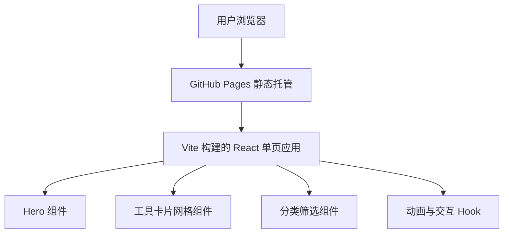

## 1. 架构设计



## 2. 技术选型

- **前端框架**：React 18 + TypeScript
- **构建工具**：Vite
- **样式方案**：Tailwind CSS
- **路由**：react-router-dom（为后续工具页面预留）
- **图标**：lucide-react
- **动画**：CSS 动画 + Framer Motion（如需要更复杂编排）
- **状态管理**：React useState/useReducer（当前规模无需引入全局状态库）
- **部署**：GitHub Pages

## 3. 路由定义

| 路由 | 用途 |
|------|------|
| / | 首页，展示 MAX 工具箱主页 |

## 4. 项目结构

```
/
├── .trae/documents/        # 产品与技术文档
├── public/                 # 静态资源
├── src/
│   ├── components/         # 可复用组件
│   │   ├── Hero.tsx
│   │   ├── ToolCard.tsx
│   │   ├── ToolGrid.tsx
│   │   ├── CategoryFilter.tsx
│   │   ├── Footer.tsx
│   │   └── GlassNavbar.tsx
│   ├── data/               # 工具数据
│   │   └── tools.ts
│   ├── App.tsx
│   ├── main.tsx
│   └── index.css
├── index.html
├── package.json
├── vite.config.ts
├── tailwind.config.js
└── tsconfig.json
```

## 5. 数据模型

工具卡片数据结构：

```typescript
interface Tool {
  id: string;
  name: string;
  description: string;
  category: 'video' | 'life' | 'utility' | 'fun';
  icon: string; // lucide icon name
  color: string; // 卡片强调色
  href?: string; // 链接或占位
}
```

## 6. 构建与部署

- 使用 `vite build` 生成 `dist/` 目录
- 配置 `vite.config.ts` 的 `base` 为仓库名
- 通过 GitHub Actions 或手动推送 `dist/` 到 `gh-pages` 分支
- 最终通过 `https://<username>.github.io/<repo-name>/` 访问
